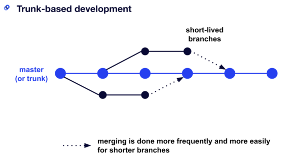

# CDK Monorepo Starter Project

### CDK Monorepo
A monorepo (short for monolithic repository) is a software development strategy where code for many applications, which may or may not be mutually dependent, is stored in the same version-controlled repository.

Some advantages of the monorepo approach are:

- Ease of code reuse — it is easy to abstract shared behavior into common libraries.

- Simplified dependency management — third-party dependencies are easily shared.
Atomic commits across multiple applications — you can refactor multiple applications at once with a single commit.

- Single source of truth — there’s only one version of each dependency.
Unified CI/CD — a standardized process can build and deploy every application in the repository.

This project serves as a template to easily get started on the CDK monorepo journey.

### Plugins

This project utilizes the following plugins:

* [Yarn](https://classic.yarnpkg.com/en/docs/getting-started): tool to enable workspaces that allows users to install dependencies from multiple package.json files in subfolders of a single root package.json file.
* [Lerna](https://lerna.js.org/): tool that optimizes the workflow around managing multi-package repositories with git by providing high-level commands. Lerna with Yarn Workspaces make it possible to develop across multiple components without having to publish them to a registry.
* [Husky](https://typicode.github.io/husky/#/): enables native git hooks tools to standardize git commits.
* [Eslint](https://eslint.org/docs/user-guide/getting-started): configure rules and syntax validation that fit the needs of your project. 
* [Prettier](https://prettier.io/docs/en/index.html): an opinionated code formatter.
* [Commitlint](https://commitlint.js.org/#/): checks if your commit messages meet the conventional commit format.
* [Commitizen](https://commitizen-tools.github.io/commitizen/changelog/): will generate a changelog following the committing rules established.
* [AWS/JSII](https://aws.github.io/jsii/): enables the AWS Cloud Development Kit to deliver polyglot libraries from a single codebase.
* [Webpack](https://webpack.js.org/): module bundler for JavaScript.

### Trunk-based Development (TBD)

Branching model for software development where developers merge every new feature, bug fix, or other code change to one central branch in the version control system. Trunk-based development is a methodology for releasing new features and small changes quickly while helping to avoid lengthy bug fixes and "merge hell".



* Commitizen plugin automates the whole package release workflow including: determining the next version number, generating changelog, and publishing the package. It analyses the commit messages, which are usually in a well known format like Conventional Commits, and then decides the next version.

### Initial Setup

Execute following commands:

1. npm install --global yarn
2. npm install --global lerna
3. git clone https://github.com/mrwconsulting/monorepo.git
4. cd monorepo
5. yarn (this will download all supporting packages)

## Useful Scripts
#### *Usage* [from parent folder]: yarn ==<script name\>== 
#### *Usage* [within packages folder]: lerna ==<script name\>==

* [cdk:build]: 
* [cdk:deploy]:
* [cdk:synth]:
* [clean]:
* [lint]:
* [lint:fix]:
* [test]:
* [version:beta]:
* [version:release]:

The execute the following commands in order:
* resolve dependencies
   ``` 
    yarn install -f
    ```
* build project
    ```
    yarn cdk:build
    ```
* execute tests
    ```
    yarn test
    ```    
* generate cloudformation template
    ```
    yarn cdk:synth
    ```        
* deploy cloudformation stack
    ```
    yarn cdk:deploy
    ```    
