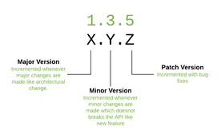
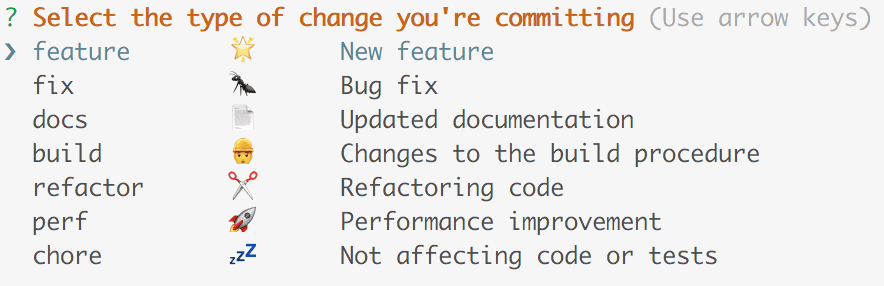
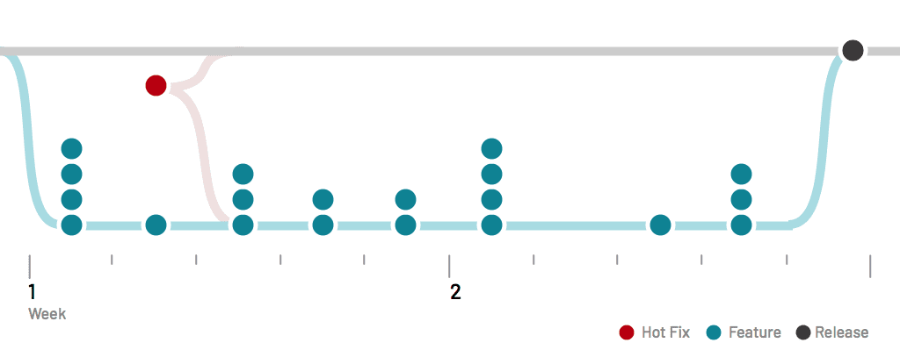

# Release Strategy

Versioning: [Semver 2.0](https://www.example.com)
Release Cadence: Every 2 weeks
Process: Git Flow
Releases: Entirely automated, based on semantic commits
Candidates: RC versions on NPM

## Summary
Here is a detailed overview of the release strategy for the design system. The release process is designed to both maximize development velocity through continuous releases while also ensuring library stability. It uses many patterns and tooling common in open-source development, including versioning semantics, release sequencing, a branching strategy, and lots of automation.

## Versioning
In order to provide stable, predictable releases, the design system aims follow strict semantic versioning (Semver 2.0).

semantic versioning

We ensure semantic versioning is followed through the use of semantic commits. Simply put, semantic commits are a way to describe the scope of the change in your commit description in a semantic way. These commits are used to not only determine the version number for the next release, but also the packages affected and a description of the change.

semantic commits

With these conventions, we can have confidence in the stability of our releases and build powerful release automation around it (see below).

## Release Process
In order to allow for continuous development but ensure regular, stable releases we follow the Git Flow branching process. At first glance, this process can look complicated, but it can be easily broken down like so:

gitflow

Simply put, we have two parallel evergreen branches: master and develop. The master branch tracks our stable production code, whereas the develop branch tracks our most recently active work. We open feature branches off develop and regularly squash merge them back into develop as they get completed. If bugs are found after we merge, we can easily fix them before releasing them into production simply by opening and merging another branch off develop. To create a formal release, we merge commit (not squash) develop branch back into master, putting the two branches back in sync with each other.

Optionally, git flow has a few other features we leverage occasionally: hot-fixes and releases.

Hot Fixes: When a bug is encountered in production, we can open and merge a hot-fix branch directly off master, then backfill that change also into the develop branch. This enables quicker time to resolution and allows the bug to be released without also releasing unreleased features from develop.

Releases: Sometimes there are particular releases we want to spend a longer time testing before officially releasing. Alternatively, some features may want to be scheduled for a specific release. This often happens when we are planning for the next major release. In these situations, we'll open another parallel branch for the release (e.g v-9) as a holding space for these features. This branch actively tracks develop and allows us to continue releasing features through our standard process, while also queueing specific work on the side.

## Release Cadence

When building a library, the release cadence is somewhat of an art. Ideally, we release as often as features are ready, but not too often such that our library is always changing and difficult to actively maintain. Some libraries opt for continuous releases, while others prefer standard release cadences. In our design system, we've chosen a hybrid approach where we perform continuous releases for our release candidates, but a more periodic cadence for stable releases. This seems to offer the best of both patterns.

Generally, we plan stable releases on a 2 week cadence, with releases on Thursday evenings. This allows us to validate our releases are successful during off-hours and gives us time to patch (if necessary) on Fridays. This regular cadence should provide predictable expectations for when to expect a new feature to be released.

Additionally, we issue release candidate builds (X.X.X-rc-X) with each merge into develop. This allows for applications to test our upcoming releases before they are officially released. This can be done by either referencing @next or a specific rc version on NPM.

CI Automation
From generating changelogs to publishing packages and documentation, the release pipeline for the design system is entirely automated. Because we use semantic commits in conjunction with lerna (a monorepo tool), we're able to build a detailed CI workflow that manages all our releases. You can check here to see our exact workflow, but simply put it does the following:

Install Dependencies
Typecheck
Unit Tests
Build Packages
Regression Tests (Storybook)
Deploy Packages
Publish packages to NPM
Create a GitHub release
Upload assets to S3
Build Docs
Regression Tests (Docs)
Deploy Docs
Changelogs
With each release, changelogs are automatically generated based on semantic commits. Because semantic commits include the packages affected by each PR, we can automatically generate per-package changelog files as well as an aggregated changelog for the entire monorepo. To properly generate these files, it is important that feature branches are squash merged to a single commit, as each commit in develop creates an item on the changelog.

Migration Guides
For each major release, we also include migration guides. These outline every specific breaking change with examples of the code both before and after the release. We hope this is a great resource when upgrading your version of the library.

These guides can be found here

Quality & Stability
In building a library, it's our commitment to only release work we intend to support and strictly leverage semver to communicate the scope of changes made. We are careful to only release breaking changes in major version updates, including the following:

Renames & removals of components, functions, or props
Delete/Rename i18n keys (until non en translations are also updated)
Major dependency upgrades that affect clients
Moving a dependency to a peer dependency
Non-additive changes to types
That said, in an effort to maintain steady release cadence, we often merge features that are not yet stable or ready for public consumption. These features should not be used, as they are still experimental and will not follow our careful versioning system for any future changes. There are a few ways we indicate these things.

UNSAFE
We regularly build functions and components that are simply used internally by the library. Additionally, some functions may be planned for release but are still actively changing. In each of these cases, we add a prefix UNSAFE_ (e.g. UNSAFE_dateFormatter()) to indicate these are not safe to use.

Unlisted Docs
We aim to fully support anything that is publicly browseable in our docsite. To that end, we often will draft documentation pages for components that are not yet released and are still actively changing. We do this to provide a resource to those assisting with testing and developing components. These pages are denoted with hidden: true property in their frontmatter. While they can be viewed with a direct url link, they do not show in any of the navigation and should be assumed unsafe to use.

Exports
A good rule of thumb to determine the stability of an export is:

Does it use the UNSAFE_ prefix?
Is its documentation hidden from the navigation?
If either of these are true, it is likely not stable. Feel free to use all other exports.